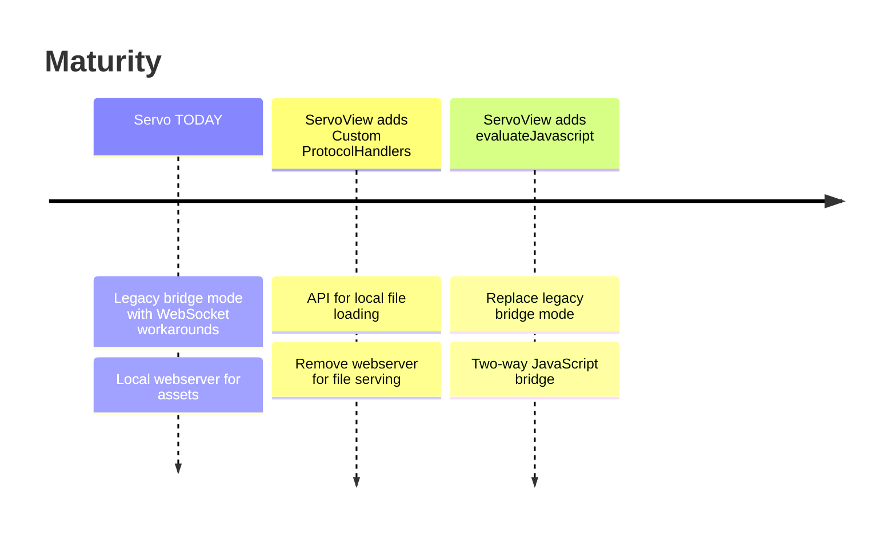

# Servo for Cordova

> [!WARNING]  
> This plugin is built to demonstrate the usage of Servo in Cordova. Due to some workarounds that involve an embedded web server and websockets it's not secure and **SHOULD NOT BE USED IN PRODUCTION app**. Read more under [Limitations](#limitations)

With this plugin for [Apache Cordova](https://cordova.apache.org) you can try [Servo](https://servo.org) as an alternative engine on **Android (for now)**.

## Why?

> Servo aims to empower developers with a lightweight, high-performance alternative for embedding web technologies in applications. 

From [servo.org](http://servo.org)

Servo looks promising as a new engine to power your WebView independently of the WebView the host operating system provides.

## How to use

You can add this to any Cordova app with:

```
cordova plugin add https://github.com/NiklasMerz/cordova-plugin-servo-webview
```

Because app assets are served with a local web server you need to adjust this in config.xml:

```xml
<content src="http://localhost:5000" />
```

## Status

This is the **first stage of development**. Which means this plugin uses a build from Servos main branch without any modifications and just the current APIs. It works with some workarounds.



## Limitations

Servo and it's ServoView Java implementation allow embedding Servo in Android apps. Servo lacks some APIs that make it a perfect replacement for Android WebView. Therefore some workarounds are part of this version that have some serious drawbacks:

1. The Cordova ↔ Native bridge uses a legacy bridge mode and quite a few hacks to leverage a local websocket server for communication between the WebView and native code. **It's slow, unreliable and insecure, unfortunately**.
2. Servo does not have something similar to [WebViewAssetLoader](https://developer.android.com/reference/androidx/webkit/WebViewAssetLoader) to "host" local files for the WebView therefore this plugin has a local web server to host the assets in `www`

## Updating the Servo version

If you want to update the Servo version yourself check out the README in `/libs` directory where and how to get the latest build of Servo.

## Funding

This project is funded through [NGI Mobifree Fund](https://nlnet.nl/mobifree), a fund established by [NLnet](https://nlnet.nl) with financial support from the European Commission's [Next Generation Internet](https://ngi.eu) program. Learn more at the [NLnet project page](https://nlnet.nl/project/W3CWebview-tooling).

[](https://nlnet.nl)
